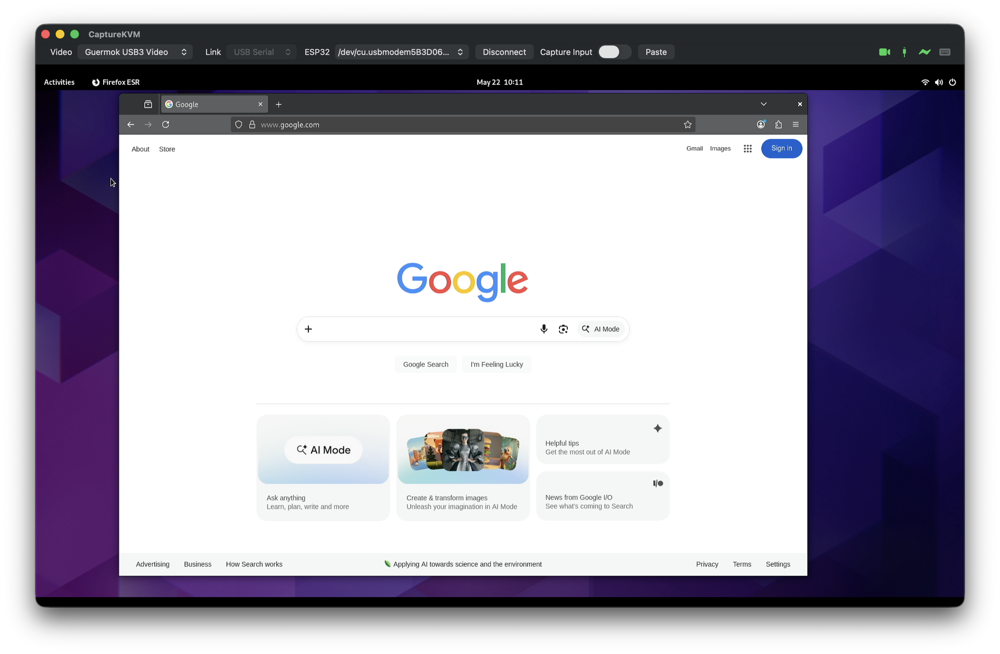

# CaptureKVM

A do-it-yourself KVM for your Mac. See and control any headless or remote machine — BIOS screens, headless servers, locked Linux boxes, the works — all from a window on your Mac.



```
+---------------------+       +-----------+        +-------------+
| Target (any OS,     |  HDMI |  USB-C    |  USB-C |             |
| even BIOS / locked) |------>|  capture  |------->|             |
|                     |       |  card     |        |             |
|                     |       +-----------+        |   Your Mac  |
|                     |<-- USB HID --+             |             |
+---------------------+              |             |             |
                                     |             |             |
                          +----------+----------+  |             |
                          | ESP32-S3 KVM bridge |<-+ (USB or BLE)|
                          +---------------------+  |             |
                                                   +-------------+
```

## What you'll be able to do

- **See** the target's screen live on your Mac in a window.
- **Control** the target with your Mac's keyboard and mouse.
- **Paste** text from your Mac's clipboard into the target.
- Works on **BIOS, fresh installs, locked screens** — anywhere a USB keyboard + mouse would.
- Connect to the bridge over **USB Serial** (wired, lowest latency) or **Bluetooth Low Energy** (wireless, encrypted, PIN-paired). Pair once and macOS reconnects silently. Or turn the radio off entirely for hardware-only mode.

## Quick start

1. **Download** the latest release of the Mac app from [github.com/abartrim/CaptureKVM/releases](https://github.com/abartrim/CaptureKVM/releases). Drag `CaptureKVM.app` to your Applications folder.
2. **Plug the ESP32 board's "COM" port** into your Mac with a USB-C data cable.
3. **Flash the firmware:** launch the app → **Settings** (⌘,) → **Firmware** tab → pick the port → **Flash bundled firmware**. Takes ~10 seconds. The board resets to the new firmware when done.
4. **Wire it up:**
   - ESP32 **"USB" port** → target machine
   - Target's HDMI/DP output → USB-C video capture card → your Mac
   - Capture card → your Mac
5. In the app: pick the video device, pick the ESP32 serial port, click **Connect**, click anywhere on the preview to capture input. **fn+Esc** releases capture.

That's it.

## Hardware you'll need

| | Item | Notes / where to get |
| --- | --- | --- |
| 🧠 | **ESP32-S3-DevKitC "Dual Type-C" board** | Any flash size from 4 MB to 16 MB; PSRAM is *not* required. Look for boards labelled "ESP32-S3 Dev Kit C" with **two USB-C connectors** (one labelled `USB`, one labelled `COM` or `UART`). Available on [AliExpress](https://www.aliexpress.com/wholesale?SearchText=ESP32-S3+dual+type-c), [Amazon](https://www.amazon.com/s?k=esp32-s3+dual+type-c+devkit), or any Espressif reseller. Around $10–15. |
| 🎥 | **USB-C UVC video capture card** | I use the [Guermok 4K USB3.0 HDMI to USB-C](https://www.amazon.com/dp/B08Z3XDYQ7), 1080p60. Any generic UVC capture stick should work; ~$15–30. |
| 🔌 | **Two USB-C data cables** | One for Mac↔ESP32 ("COM" port), one for ESP32 ("USB" port) ↔ target. Charge-only cables won't work — make sure they're **data** cables. |
| 📺 | **Cable from target video out → capture card** | Usually HDMI-to-HDMI; sometimes HDMI-to-USB-C if the target has a USB-C display output. |
| 💻 | **A Mac running macOS 15 (Sequoia) or newer** | The pre-built app targets macOS 26.5; if you need an older OS, build from source (see [BUILDING.md](BUILDING.md)). |

> **Tip:** You can run the bridge from any ESP32-S3 board with native USB OTG, even ones with only a single USB-C connector — you'd just need to manually pair flashing/control on one cable and HID on the other via a hub. Boards with the dual-USB-C layout make it plug-and-play.

### Printable case (optional)

[`ESP32KVMFirmware/ESP32-S3 Dual USB-C Case.3mf`](ESP32KVMFirmware/ESP32-S3%20Dual%20USB-C%20Case.3mf) is a tidy print-in-place case for the board. Original design by the [ESP32-S3-DevKitC pins and no pins case](https://makerworld.com/en/models/551019-esp32-s3-devkitc-pins-and-no-pins-case) on MakerWorld — please visit the MakerWorld page for the designer credit + license terms (download the original from there if you intend to remix or redistribute it).

## Using the app

### Connecting

The toolbar has a **Link** picker:

- **USB Serial** — lowest latency, wired. Just plug the ESP32's COM port into your Mac and click Connect.
- **Bluetooth Low Energy** — wireless. Requires one-time pairing with a 6-digit PIN; afterwards macOS reconnects silently.

Pick a device in the right-hand dropdown and click **Connect**.

### Bluetooth — one-time setup

The ESP32 generates a random 6-digit PIN on first boot, stored permanently on the board. Pairing uses **LE Secure Connections** with that PIN. The bridge is locked down: only paired Macs can write to it, so nobody else in BLE range can sniff or inject input.

1. **Connect once over USB Serial.** This is the only way to read the bridge's PIN — physical access required.
2. Open **Settings (⌘,) → Bluetooth**. You'll see the **PIN** (e.g. `277481`) with a green **Live** badge. Memorise it or copy it.
3. Click **Switch to Bluetooth & start pairing**. The app disconnects USB, switches Link to Bluetooth, scans, and auto-selects the first KVM bridge it sees.
4. Click **Connect** in the main toolbar. macOS pops a system pairing dialog asking for the 6-digit code — type the PIN.
5. Done. The bond is persisted in macOS' keychain; future BLE connects are silent.

Want to revoke pairing or rotate the PIN? Reconnect over USB Serial and hit **Rotate PIN** in Settings → Bluetooth. All existing bonds are cleared on the bridge side.

Want zero wireless attack surface? Reconnect over USB Serial and flip **BLE radio enabled** off in Settings → Bluetooth. The radio shuts down completely; only the wired link controls the bridge from then on. The setting persists across reboots.

### Controlling

- **Click anywhere on the preview** to start capturing keyboard + mouse. The host cursor hides; your mouse drives the target's cursor (shown in the captured video).
- **fn + Esc** releases capture and brings your host cursor back. Plain Esc passes through to the target.
- **Paste to Target** (or **Cmd+Shift+V** during capture) types your Mac clipboard into the target as keystrokes.

### Status

The ESP32 has a small RGB LED that's mostly off (so it doesn't blink in a dark room):

- **Brief blue flash** — frame received, things are flowing.
- **Slow red blink** — the *target* doesn't see the bridge as a USB HID. Check the cable from the ESP32's "USB" port to the target.
- **Off** — idle and fine.

## Help

Open the app and hit **⌘?** for a full in-app help window covering pairing, hotkeys, the ⌘↔⌃ swap toggle for Linux/Windows targets, function-key behaviour, and troubleshooting.

## Troubleshooting

| Symptom | Likely fix |
| --- | --- |
| Capture card doesn't appear in the **Video** dropdown | Allow camera access in macOS Privacy settings, then quit + relaunch the app. |
| "No response from ESP32 at any baud" | Re-flash from Settings → Firmware. If that fails too, hold the BOOT button while pressing RESET on the board, then flash. |
| Target enumerates as a keyboard but no keys reach it | Check the USB-C cable on the ESP32's "USB" port — many cables are power-only. |
| Function keys do nothing on the target | macOS swallows F-keys for system functions by default. Press **fn + F-key**, or enable *Use F1, F2, etc. as standard function keys* in System Settings → Keyboard. |
| `Cmd+C` / `Cmd+V` don't copy/paste on a Linux/Windows target | Open Settings → Keyboard; make sure **Swap ⌘↔⌃** is enabled (it is by default). |
| Pasted text drops characters | Paste is synthesized keystrokes at ~60 chars/sec. Make sure the target focus is on a text field; non-ASCII characters are silently skipped. |
| ESP32 doesn't appear in the Bluetooth dropdown | Make sure the LED isn't a slow red blink (target not enumerated → power issue). Click **Switch to Bluetooth & start pairing** from Settings → Bluetooth — that scan finds it within ~2 seconds. As a last resort: `sudo pkill bluetoothd` to flush macOS' BT cache, then relaunch the app. |
| Bluetooth pairing prompt never appears | The first time you connect via BLE, macOS pops a *system* dialog (often as a notification banner) — sometimes it's hidden behind another window. Look in the top-right notifications, or click the BT icon in the menu bar. |
| Bluetooth was working, now connect fails | Your old bond may be stale (e.g. after a Rotate PIN). In Settings → Bluetooth, rotate the PIN again to clear bonds on the bridge side; on the Mac, **System Settings → Bluetooth → ⓘ next to KVM-XXXX → Forget This Device**, then re-pair. |

## Going deeper

If you want to build the app from source, modify the firmware, or just understand how it all fits together, see **[BUILDING.md](BUILDING.md)**:

- Repository layout
- Architecture and wire protocol
- Building the macOS app from source
- Modifying and re-flashing the firmware
- Memory usage, security model, known limitations

## License

CaptureKVM is licensed under the **GNU General Public License v3.0**. See [LICENSE](LICENSE) for the full text. If you modify and distribute it (or anything based on it), you have to share your modifications under GPL v3 too — that's the deal.

[NOTICE.md](NOTICE.md) lists the third-party software bundled or statically linked into the project (`esptool`, Arduino-ESP32, NimBLE-Arduino, TinyUSB) with their respective licenses and copyright holders.
